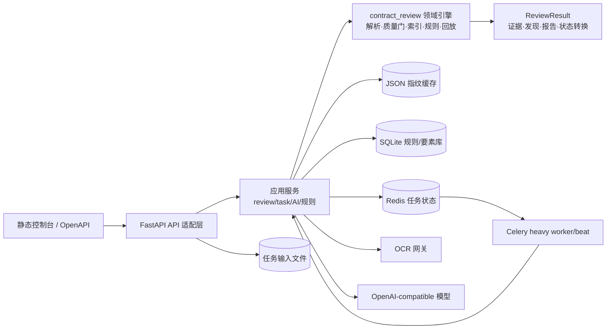

# 合同审查智能体架构

本文档描述当前可运行架构、已经落地的稳定性改进，以及下一阶段的演进边界。它是实现与验收的约束，不把尚未具备运行证据的能力写成已交付能力。

## 1. 设计结论

当前项目采用“证据优先的模块化单体 + 可选异步工作队列”。这个边界与项目实际规模相符：合同审查的确定性规则、证据索引、回放和人工确认需要共享同一份强类型领域模型；OCR、模型和 Celery/Redis 则通过适配器接入。暂不引入微服务拆分、全量多智能体编排或新的状态框架。

架构的不可变约束如下：

- 每个发现、模型结论和人工决定都必须引用已持久化的证据 ID；不能因为模型没有把握就补造证据。
- 文档、规则、模型、提示词、配置和结果都带版本或指纹；同一输入应可以重放并校验结果指纹。
- OCR、模型和向量服务失败时，结果必须显式降级到 `UNKNOWN`/人工复核，不能静默通过。
- 上传内容、运行时数据库、缓存和 Token 不进入 Git；外部服务只通过配置的网关访问。
- API 错误对调用方保持稳定且不泄漏内部路径、SQL、堆栈或供应商响应；完整诊断只进受控日志。

## 2. 当前组件与职责



### 领域引擎：`src/contract_review`

领域引擎不依赖 FastAPI、Redis 或 Celery。`parser.py` 负责 PDF/DOCX/XLSX 与 OCR 坐标解析，`index.py` 和 `knowledge.py` 建立证据与知识块，`engine.py` 执行规则，`pipeline.py` 负责确定性编排，`replay.py` 校验输入/结果指纹，`models.py` 是跨阶段的 Pydantic 契约。

`ReviewStatus` 当前状态链为：

```text
RECEIVED → PARSED → QUALITY_GATED → INDEXED → EXTRACTED
         → RULE_CHECKED → [SEMANTIC_REVIEWED] → HUMAN_REVIEW
         → FINALIZED
```

失败会进入 `FAILED`，未知证据和未实现能力仍保留在人工复核范围内。`ReviewRun.transitions` 是同步审查的审计轨迹；它与最终 `result_fingerprint` 一起用于回放。

### 应用服务：`src/contract_review_app/services`

- `review_service.py`：组合文件指纹、规则快照、解析、印章证据、语义客户端和缓存。
- `ai_analysis.py`：调用模型输出结构化风险项，绑定证据后与规则发现合并；候选规则只能进入 `draft`，须人工确认。
- `task_service.py`：负责上传落盘、任务状态和 Celery 入队；同步 Redis/文件适配器在异步 API 中通过线程池调用。
- `result_cache.py`：以输入/规则/模型/提示词指纹为键的可选缓存，使用同目录临时文件加原子替换。
- `rule_evolution.py`、`element_schema.py`：SQLite 中的规则和要素定义，不改写源合同文件。

### 适配层与运行时

`api/` 只处理鉴权、DTO、HTTP 错误和上传读取；`tasks/` 只处理 Celery 生命周期、心跳、重试、死信和清理；`telemetry/` 负责请求 ID、日志和 Prometheus 指标。`bootstrap.py` 支持 `api`、`worker`、`beat` 和本地 `all` 角色。

## 3. 关键数据流

### 同步审查

1. API 读取并限制每个上传文件大小。
2. 应用服务在线程池中运行确定性审查；文件按稳定 `document_id` 排序，保证上传顺序不影响指纹。
3. 解析质量门、证据索引、知识检索和规则执行产生 `ReviewResult`。
4. 如配置了模型，再调用语义客户端；模型请求/响应指纹、规则 ID 和证据 ID 在引擎边界复核。
5. 可选 AI 风险分析只消费已生成结果；缓存命中不跳过证据校验。
6. 返回报告并停在 `HUMAN_REVIEW`，人工决定通过追加修订记录完成闭环。

### 异步任务

1. 先校验任务类型，再把上传文件写入任务目录和 `input.json` manifest。
2. Redis 保存 `PENDING` 记录，Celery 投递到 `contract.heavy` 队列。
3. worker 取得任务锁，按阶段更新心跳/进度，调用同一应用服务和领域引擎。
4. 成功结果写入 Redis 并进入 TTL；异常按错误码、重试次数和死信策略处理。
5. reconcile/cleanup 负责僵尸任务、过期结果和残留输入。

## 4. 本轮已落地的架构改进

这些改动保持现有 API 形状，均有回归测试：

- 请求上下文 ID 现在贯穿成功/业务错误响应；未捕获异常只返回稳定的未知错误码，内部异常仅写日志。
- 结果缓存改为同目录临时文件 + `os.replace`，读者不会看到半个 JSON；写入失败会清理临时文件并降级为未命中。
- 异步任务在写入输入前验证 dispatch 配置；Redis 状态创建失败时删除已写输入，避免孤儿任务目录。
- Redis、文件和 SQLite 适配器不再直接阻塞 FastAPI 事件循环，查询任务和规则/要素管理接口统一使用 `asyncio.to_thread`。

## 5. 从优秀项目吸收的模式

本项目只吸收与证据边界相容的模式，不复制整套框架：

- [OpenAI Agents SDK guardrails](https://github.com/openai/openai-agents-python/blob/main/docs/guardrails.md) 的输入/输出/工具门禁启发了“在外部副作用前校验结构和权限”的边界；当前对应实现是语义响应的规则 ID、指纹和证据 ID 校验。
- [OpenAI Agents SDK tracing](https://github.com/openai/openai-agents-python/blob/main/docs/tracing.md) 和 [OpenTelemetry 语义约定](https://opentelemetry.io/docs/specs/semconv/registry/attributes/gen-ai/) 说明了应以 trace/span 关联阶段、模型、工具和耗时，同时默认过滤敏感内容；当前先保留请求 ID、结构化日志和指标，后续再接可选 OTEL exporter。
- [LangGraph persistence](https://docs.langchain.com/oss/python/langgraph/persistence) 的 thread-scoped checkpoint 与 durable store 对应本项目已有的 `ReviewRun.transitions` 和 Redis 任务记录；下一阶段补充独立事件账本，而不是替换领域引擎。
- [openreview-cli 的流水线设计](https://github.com/mohamed-benoughidene/openreview-cli/blob/main/ARCHITECTURE.md) 将解析、隐私门、条款抽取、QA、引用核验和报告拆成可恢复阶段；本项目沿用“先质量门、再检索/规则、最后模型与人工”的顺序。
- [legal.ai 的 provenance 与人工门](https://github.com/saiabhinav001/legal.ai/blob/main/README.md) 强调每个字段回指源文档片段，低置信度进入人工确认；这与本项目的 `Evidence`、`Finding`、`ReviewDecision` 和 `HUMAN_REVIEW` 状态一致。
- [Docling Graph provenance](https://docling-project.github.io/docling-graph/fundamentals/graph-management/provenance/) 的“来源账本是事实源、无法确定时留空”原则，强化了本项目 `fail-closed` 的证据绑定约束。
- [LlamaIndex structured output](https://docs.llamaindex.ai/en/latest/understanding/agent/structured_output/) 与 [Semantic Kernel Process](https://learn.microsoft.com/en-us/semantic-kernel/frameworks/process/process-framework) 分别提示结构化输出和事件驱动阶段的价值；本项目优先使用已有 Pydantic 模型和状态转换，不为此引入新的编排框架。

## 6. 分阶段演进路线

### P1：边界契约（下一步）

- 为任务创建、规则编辑、要素编辑和 AI 合同类型增加 `extra="forbid"` 的 Pydantic DTO；保留表单兼容层，但让 JSON/OpenAPI 契约可生成。
- 为任务创建增加 `Idempotency-Key` 和 Redis 原子 admission；同一请求重试只返回原任务，不重复入队。
- 把 `ReviewRun.transitions` 和异步任务状态抽象为统一的阶段事件模型，保留当前 Redis/JSON 适配器。

### P2：生产可观测与隐私

- 在不记录合同正文/Token 的前提下增加可选 OpenTelemetry trace，关联 `request_id`、`run_id`、task、model、tool 和 token/耗时摘要。
- 外部模型/OCR 调用前增加可配置的 PII/敏感字段门；无权发送或无法脱敏时 fail-closed，并说明人工处理路径。
- 为每个阶段记录重试、耗时、输入/输出指纹和降级原因，形成可查询的运行报表。

### P3：质量与部署

- 建立带固定合同夹具的离线评测：证据召回、规则覆盖、模型 JSON 合规、重放一致性和人工决定完整性。
- 在具备 Docker daemon、Redis、OCR 和模型环境的 CI/验收机上补运行验证；本机未具备这些依赖时只能报告阻塞，不能伪造通过。
- 需要独立扩缩容时再拆 worker 或检索服务，先用接口/事件契约隔离，避免把共享事务状态拆散。

## 7. 验收与回滚

本分支的最小门禁：

```bash
uv lock --check --no-config --offline
uv run --no-sync ruff check src tests scripts/ci_api_smoke.py
uv run --no-sync pytest -q --basetemp .test-work/pytest-tmp-final-2
uv run --no-sync python scripts/ci_api_smoke.py
```

若后续阶段失败，回滚优先按适配器边界进行：关闭缓存、关闭 AI/向量调用、切回同步 API 或停用异步角色都不应破坏 `contract_review` 的确定性审查和回放数据。任何声称“生产就绪”的结论仍需补充 Docker、Redis、OCR、模型和真实合同脱敏验收证据。
