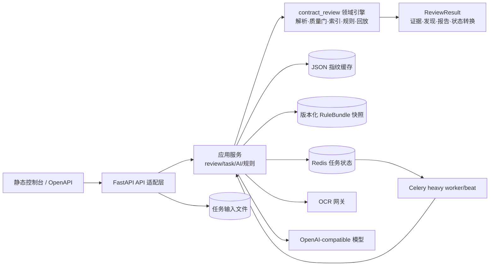

# 合同审查智能体架构

本文档描述当前可运行架构、已经落地的稳定性改进，以及下一阶段的演进边界。它是实现与验收的约束，不把尚未具备运行证据的能力写成已交付能力。

## 1. 设计结论

当前项目采用“证据优先的模块化单体 + 可选异步工作队列”。这个边界与项目实际规模相符：合同审查的确定性规则、证据索引、回放和人工确认需要共享同一份强类型领域模型；OCR、模型和 Celery/Redis 则通过适配器接入。暂不引入微服务拆分、全量多智能体编排或新的状态框架。

架构的不可变约束如下：

- 每个发现、模型结论和人工决定都必须引用已持久化的证据 ID；不能因为模型没有把握就补造证据。
- 文档、规则、模型、提示词、配置和结果都带版本或指纹；同一输入应可以重放并校验结果指纹。
- OCR、模型和向量服务失败时，结果必须显式降级到 `UNKNOWN`/人工复核，不能静默通过。
- 知识块显式区分 `source_kind=contract` 与 `source_kind=rule`；规则块可以解释判断标准，但模型结论只能引用合同正文证据。
- 上传内容、运行时数据库、缓存和 Token 不进入 Git；外部服务只通过配置的网关访问。
- API 错误对调用方保持稳定且不泄漏内部路径、SQL、堆栈或供应商响应；完整诊断只进受控日志。

## 2. 当前组件与职责



### 领域引擎：`src/contract_review`

领域引擎不依赖 FastAPI、Redis 或 Celery。`parser.py` 负责 PDF/DOCX/XLSX 与 OCR 坐标解析，`index.py` 和 `knowledge.py` 建立证据与知识块，`engine.py` 执行规则，`pipeline.py` 负责确定性编排，`replay.py` 校验输入/结果指纹，`models.py` 是跨阶段的 Pydantic 契约。

`ReviewStatus` 当前状态链为：

```text
RECEIVED → PARSED → QUALITY_GATED → INDEXED → EXTRACTED
         → RULE_CHECKED → [SEMANTIC_REVIEWED] → HUMAN_REVIEW
         → FINALIZED
```

失败会进入 `FAILED`，未知证据和未实现能力仍保留在人工复核范围内。
`ReviewRun.stage_events` 是结果内的事件快照，独立 `StageEventStore` 是统一追加/读取
边界；系统不再维护第二套 `ReviewTransition`。事件账本和最终
`result_fingerprint` 共同用于审计与回放。

### 业务对象、规则和接口契约

合同审查的核心业务链按以下边界实现：

```text
ReviewContext（本次业务前提）
        ↓
ContractPackage / Document / Evidence（合同包与证据）
        ↓
ContractClause / ClauseRelation / ContractObligation（条款、关系与履约义务）
        ↓
RuleBundle / PlaybookSpec（规则快照与企业立场）
        ↓
RetrievalQuery → RetrievalTrace → CandidateEvidence → EvidenceAssessment（候选证据与资格裁决）
        ↓
Finding / ReviewQuestion / QuestionAssessment（审查结论）
        ↓
ReviewDecision / ContractVersionComparison / ContractRevisionSet（人工确认、版本比对与红线建议）
```

- `ReviewContext` 统一保存合同类型、本方立场、法域、交易背景标签、交易金额、实际文档角色和可选规则范围；合同包另保存文件角色与显式优先顺序。`ApplicabilitySpec`/`ApplicabilityException` 将这些字段作为结构化适用条件，`document_kinds` 表示全部角色条件，`document_kinds_any` 表示至少命中一种角色；缺失事实或未识别角色保持 `UNKNOWN`。`ContractType` 入口优先使用 `RuleBundle` 规范名称，已登记短名称只在规则解析层归一，不能与上下文中的合同类型冲突，未登记类型保持适用性未知。
- `rules.py` 统一负责规则范围选择、合同类型适用性和规则预期值解析；`playbook.py` 统一负责优选/备选/禁止立场、缺失条款处置和动作生成，Router 与任务处理器不复制这些判断。
- 规则快照版本与 Playbook 自身版本是两个独立版本轴；发布门禁分别保留二者，另以 `compatible_review_schema`、Playbook 校验结果和 `release_fingerprint` 判断能否进入正式审查，不用字符串相等制造错误拒绝。
- `Rule.applicability` 的每个合同类型声明可以进一步约束本方立场、法域、交易标签、金额区间、文档角色和结构化例外；`PlaybookSpec.escalation_thresholds` 负责金额升级门禁。条件事实缺失时统一返回 `UNKNOWN`，不能折叠为不适用或通过。
- `ReviewResult.rule_bundle` 始终保留完整规则快照，`review_context.review_scope` 只决定本次执行的规则白名单；所有条款、发现、问题和修订操作继续通过 `Evidence` 回指原文。
- `data/contract_core_rules_v0.15.json` 以独立扩展快照承载付款、交付、验收、续期、终止、违约责任和跨文档一致性规则；应用服务合并基础快照与扩展快照，重复 `rule_id`、Playbook 冲突或 Schema 不兼容直接失败。
- `Rule.checker` 是规则快照到确定性业务检查器的唯一绑定；`rule_checkers.py` 集中负责金额、税率、付款、发票和附件完整性计算，缺少绑定或结构化事实不足时统一生成 `UNKNOWN`，不在 Router、任务处理器或提示词中复制规则分支。
- 付款、交付、验收、续期、终止和违约责任先抽取为带原文证据的 `contract_term:*` 事实；跨文档检查只比较至少覆盖规则要求事实类型的多文档候选，缺少任一比较口径时保持 `UNKNOWN`，不把局部一致性当成全包通过。
- 财务事实先由 `facts.py` 以带证据的 `ContractFact` 形成，检查器只消费 `RuleCheckContext`，因此“事实抽取—规则判断—发现输出”三层职责可独立替换和回放。
- `ClauseRelation` 是条款关系的唯一结果对象：确定性构建器只登记明确的父子层级、定义项和条款编号引用；引用目标不存在或编号重复时保留 `UNRESOLVED`，不得把未解析的关系当作审查通过。
- `KnowledgeChunk.source_kind` 统一区分合同事实和规则依据；来源类型必须显式声明，不再从旧元数据推断。语义检索没有合同正文命中时不调用外部模型，规则发现保持 `UNKNOWN` 并进入人工复核。
- 每条适用规则都必须走同一条 `RetrievalQuery → RetrievalTrace → CandidateEvidence → EvidenceAssessment` 链路；`CandidateEvidence` 只是召回候选，`EvidenceAssessment` 才裁决候选是否具备确定性事实/规则消费资格。关键词扫描仍可作为词法候选生成器，但不得成为条款识别或事实抽取的旁路入口。
- 中文术语归一使用版本化的高置信词形变体，只扩展查询、词法候选和证据锚点匹配，不改写合同原文；法律效果可能不同的概念必须继续由规则显式声明，不能仅凭词面相近自动合并。
- 配置 embedding 后由应用适配层执行 BM25 词法与向量候选召回，并使用固定 `RRF_K=60` 的 Reciprocal Rank Fusion 融合名次：词法命中保留精确术语、数字、否定和定义短语，规则声明必要事实时合同正文还必须命中共享术语目录中的事实锚点，向量命中补充语义相近表达。`RetrievalQuery` 携带规则版本、查询意图、精确/数字/否定锚点和结构化过滤；`RetrievalTrace` 持久化过滤条件、融合方式和各来源名次，轨迹命中再规范化为 `CandidateEvidence`。召回结果仍只是候选证据，不产生 `Finding` 或其它审核结论，最终判断只能来自规则检查器或通过证据门禁的语义审查。
- 同步 `POST /api/v1/contract-review` 使用显式表单字段 `PackageId`、`ContractType`、`PartyPosition`、`Jurisdiction`、`TransactionContext`、`TransactionTags`、`TransactionAmount`、`DocumentKinds`、`DocumentPrecedence`、`ReviewScope`，返回 `ContractReviewResponse`；异步接口把同一上下文和合同包角色序列化进任务 manifest，由任务处理器还原为 `ReviewContext` 与 `ContractPackage`。
- `POST /contract-review/decision` 和 `POST /contract-review/finalize` 的请求体分别是 `ReviewDecisionRequest`、`ReviewFinalizationRequest`，都必须携带完整 `ReviewResult`；应用服务先执行完整性、证据和指纹门禁，再追加 `ReviewDecision` 或推进 `FINALIZED`，不接受只传旧风险清单的部分更新。
- `ContractVersionComparison` 和 `ContractRevisionSet` 是 `ReviewResult` 的后置领域附件；挂载时生成 `EvidenceType.COMPARISON` 证据，更新 `ReviewRun`/`ReviewReport` 指针、结果指纹和 `post_review_sequence`，因此版本差异和红线建议不会形成第二套结果对象。
- 版本比对只有在两侧文档都属于当前合同包且都出现在完整 `document_precedence` 中时才解析 `base/compare` 覆盖关系；外部比较文件、部分优先序列或未配置优先序列均输出 `unresolved`。每个影响项同时保留受影响业务义务、付款风险、责任风险、责任上限是否扩大、交付/验收绑定变化和需要重触发的规则；责任上限的数值、例外或适用主体无法从差异片段确定时输出 `requires_review`，不自动放行。
- 语义模型的 `PASS` 需达到更高置信度门槛并引用带原文片段的合同证据；明确要求人工复核、置信度不足或缺少合同原文时强制转为 `UNKNOWN`，并标记 `evidence_quality=INSUFFICIENT`、`automatic=false`。
- 语义模型请求携带同一 `ReviewContext`、与 `rule_ids` 逐条对应的规则定义快照，以及同一条检索链路产生的查询和候选；请求指纹覆盖这些内容，模型只能输出每条请求规则一次的枚举状态和已存在的 `evidence_id`，不能改变规则快照或企业 Playbook。缺少任一规则输出直接拒绝整批响应，不把缺失项静默降为通过。

### 应用服务：`src/contract_review_app/services`

- `review_service.py`：组合文件指纹、规则快照、解析、印章证据、语义客户端和缓存。
- `services/review_context.py`：只负责 API/任务输入的上下文解析与别名归一化，不参与规则判断。
- `models/review_schemas.py`：定义同步审查和修订提案的 HTTP 响应 DTO，不把领域模型直接作为不受约束的字典返回。
- `elements.py`：从解析快照生成带证据的标准合同要素 `ContractFact`，要素结果与审查结果共用同一个事实集合；不创建独立的抽取结果。
- `task_service.py`：负责上传落盘、任务状态和 Celery 入队；同步 Redis/文件适配器在异步 API 中通过线程池调用。
- `result_cache.py`：以输入/规则/模型/提示词指纹为键的可选缓存，使用同目录临时文件加原子替换。
- `/contract-review/rule-bundle` 直接返回正式 `RuleBundle`；标准合同要素只作为 `ReviewResult.facts` 的事实类型提供，不再暴露独立目录或抽取接口。

### 适配层与运行时

`api/` 只处理鉴权、DTO、HTTP 错误和上传读取；`tasks/` 只处理 Celery 生命周期、心跳、重试、死信和清理；`telemetry/` 负责请求 ID、日志和 Prometheus 指标。`bootstrap.py` 支持 `api`、`worker`、`beat` 和本地 `all` 角色。

## 3. 关键数据流

### 同步审查

1. API 读取并限制每个上传文件大小。
2. 应用服务在线程池中运行确定性审查；文件按稳定 `document_id` 排序，保证上传顺序不影响指纹。
3. 解析质量门、证据索引、条款关系构建、知识检索和规则执行产生 `ReviewResult`。
4. 对每条适用规则先构造 `RetrievalQuery`，索引返回 `RetrievalTrace`，再生成 `CandidateEvidence` 并执行 `EvidenceAssessment`；确定性事实抽取、Playbook/规则检查器只消费 `ACCEPT` 候选，语义请求可以查看未决候选但必须引用合同候选证据。
5. 如配置了模型，再调用语义客户端；模型请求/响应指纹、规则 ID 和证据 ID 在引擎边界复核。
6. HTTP 层直接返回 `ReviewResult`；缓存命中不跳过证据校验，也不生成第二套风险清单。
7. 返回报告并停在 `HUMAN_REVIEW`；人工决定、版本比对和最终确认继续以 `ReviewResult` 为输入，形成可回放的后置附件、`ReviewDecision` 和 `FINALIZED` 状态。

### 异步任务

1. 先校验任务类型和输入元数据，再由 Redis Lua 原子完成幂等准入、待处理上限检查和首条事件登记；此时不写合同正文。
2. 只有原子准入胜者才把上传文件写入任务目录和 `input.json` manifest，再绑定真实输入元数据并投递到 `contract.heavy` 队列；重复请求直接回放原任务。
3. worker 取得任务锁，按阶段更新心跳/进度，调用同一应用服务和领域引擎。
4. 成功结果写入 Redis 并进入 TTL；异常按错误码、重试次数和死信策略处理。
5. reconcile/cleanup 负责僵尸任务、过期结果和残留输入。

## 4. 本轮已落地的架构改进

这些改动采用审查结果 Schema v2，旧结果不再兼容，均有回归测试：

- 请求上下文 ID 现在贯穿成功/业务错误响应；未捕获异常只返回稳定的未知错误码，内部异常仅写日志。
- 结果缓存改为同目录临时文件 + `os.replace`，读者不会看到半个 JSON；写入失败会清理临时文件并降级为未命中。
- 异步任务在写入输入前验证 dispatch 配置；Redis 原子准入先登记任务，只有唯一胜者落盘输入并绑定 manifest，持久化失败会把预约任务关闭，避免重复写入和空预约。
- 阶段事件统一遵循 `StageEventStore` 契约：同步编排使用内存适配器，JSON 审计工件使用独立 `stage-events/*.jsonl`，Redis 使用独立有界列表；任务状态快照不再承担事件账本的持久化边界。
- `ReviewResult` 新增条款、履约义务、审查问题和问题结论；规则发现被明确映射为 `SUPPORTED`、`CONTRADICTED`、`NOT_MENTIONED`、`UNKNOWN` 或 `NOT_APPLICABLE`，且必须引用持久化证据。
- 删除“关闭引擎规则、截断规则快照、只解析合同”的旧分支；每次合同审查都执行完整 `RuleBundle`，模型只是有合同证据时的补充判断。
- 知识块增加显式来源类型，语义模型的证据白名单只包含合同正文命中；规则定义证据被引用时由流水线和审计同时拒绝。
- Redis、文件和规则快照适配器不再直接阻塞 FastAPI 事件循环，任务查询和规则加载统一使用 `asyncio.to_thread`。

## 5. 从优秀项目吸收的模式

本项目只吸收与证据边界相容的模式，不复制整套框架：

- [OpenAI Agents SDK guardrails](https://github.com/openai/openai-agents-python/blob/main/docs/guardrails.md) 的输入/输出/工具门禁启发了“在外部副作用前校验结构和权限”的边界；当前对应实现是语义响应的规则 ID、指纹和证据 ID 校验。
- [OpenAI Agents SDK tracing](https://github.com/openai/openai-agents-python/blob/main/docs/tracing.md) 和 [OpenTelemetry 语义约定](https://opentelemetry.io/docs/specs/semconv/registry/attributes/gen-ai/) 说明了应以 trace/span 关联阶段、模型、工具和耗时，同时默认过滤敏感内容；当前已提供可选 OTEL span，白名单只保留 ID、阶段、状态、模型和计数，不写入合同正文、提示词或密钥。
- [LangGraph persistence](https://docs.langchain.com/oss/python/langgraph/persistence) 的 thread-scoped checkpoint 与 durable store 对应本项目统一的 `StageEvent` 账本和 Redis 任务记录；当前以独立事件账本增强现有领域引擎，而不是替换它。
- [openreview-cli 的流水线设计](https://github.com/mohamed-benoughidene/openreview-cli/blob/main/ARCHITECTURE.md) 将解析、隐私门、条款抽取、QA、引用核验和报告拆成可恢复阶段；本项目沿用“先质量门、再检索/规则、最后模型与人工”的顺序。
- [legal.ai 的 provenance 与人工门](https://github.com/saiabhinav001/legal.ai/blob/main/README.md) 强调每个字段回指源文档片段，低置信度进入人工确认；这与本项目的 `Evidence`、`Finding`、`ReviewDecision` 和 `HUMAN_REVIEW` 状态一致。
- [Docling Graph provenance](https://docling-project.github.io/docling-graph/fundamentals/graph-management/provenance/) 的“来源账本是事实源、无法确定时留空”原则，强化了本项目 `fail-closed` 的证据绑定约束。
- [LlamaIndex structured output](https://docs.llamaindex.ai/en/latest/understanding/agent/structured_output/) 与 [Semantic Kernel Process](https://learn.microsoft.com/en-us/semantic-kernel/frameworks/process/process-framework) 分别提示结构化输出和事件驱动阶段的价值；本项目优先使用已有 Pydantic 模型和状态转换，不为此引入新的编排框架。

## 6. 分阶段演进路线

### P1：边界契约（幂等与事件核心已落地）

- 为异步任务创建增加 `Idempotency-Key` 和 Redis Lua 原子 admission；同一键在 TTL 内只返回原任务，只有准入胜者落盘/绑定输入并入队，待处理上限检查与首条事件写入在同一脚本中完成。
- 同步审查和异步任务共用 `StageEventStore` 契约，保留 Redis/JSON 的后端差异但统一追加/读取边界；删除重复的 `ReviewTransition`，缺少 v2 Schema 或独立事件文件的旧结果直接拒绝。
- Playbook 管理、规则审批和发布操作不属于当前运行 API；本轮只保留正式快照读取和兼容门禁，不把未实现的管理能力计入验收。
- 条款关系和混合召回已先落地确定性/适配器边界；`evals/expert_contract_review_cases.json` 另行固定每条标注规则的金标准、可接受候选、错误候选和法律表达切片，离线统计 Recall@5、Recall@10、证据引用准确率与 `unknown_false_pass`。当前在有限候选池上启用版本化的确定性证据相关性精排基线；学习型重排模型和持久化 ANN 仍需独立标注评测后再引入。

### P2：生产可观测与隐私（已落地基础能力）

- 在不记录合同正文/Token 的前提下增加可选 OpenTelemetry trace，关联阶段、`run_id`、task、provider/model 和数量摘要；SDK 未安装或追踪异常时自动 no-op。
- 在语义审查和 embedding 外发前增加默认 `block` 的高置信度 PII 门；扫描器异常、配置异常和无法读取文字时 fail-closed，并返回本地确定性/词法降级结果。
- 下一步为每个阶段补充重试、耗时、输入/输出指纹和降级原因的聚合报表；本轮先保留结构化日志和安全 span 属性。

### P3：质量与部署（离线质量门已落地，真实联调待环境）

- 建立带固定合同夹具的离线评测：证据类型、规则结果、统一检索链路、PII 门禁、阶段账本审计和重放指纹均在 CI 中执行；离线评测不访问 OCR、外部模型、Redis 或 Celery。
- 增加中文脱敏业务场景专家标注种子集；每个案例以主合同、附件/报价单/技术协议、版本或补充协议、业务背景、企业立场和专家标注闭环为最小单位，分别统计条款定位、证据引用、规则判断、`UNKNOWN` 识别、金额事实、金额计算、版本比对和红线建议；真实法务专家签字集与离线种子集分开管理，旧扁平案例格式不再兼容。
- 在具备 Docker daemon、Redis、OCR 和模型环境的 CI/验收机上补运行验证；本机未具备这些依赖时只能报告阻塞，不能伪造通过。
- 只有在检索专项评测证明进程内索引不足后，才考虑 Elasticsearch/OpenSearch 等持久化 ANN；当前优先修复查询对象、候选证据和业务规则的一致性，不以拆服务替代业务契约。

## 7. 验收与回滚

本分支的最小门禁：

```bash
uv lock --check --no-config --offline
uv run --no-sync ruff check src tests scripts/ci_api_smoke.py
uv run --no-sync pytest -q --basetemp .test-work/pytest-tmp-final-2
uv run --no-sync python scripts/ci_api_smoke.py
```

若后续阶段失败，回滚优先按适配器边界进行：关闭缓存、关闭 AI/向量调用、切回同步 API 或停用异步角色都不应破坏 `contract_review` 的确定性审查和回放数据。任何声称“生产就绪”的结论仍需补充 Docker、Redis、OCR、模型和真实合同脱敏验收证据。
